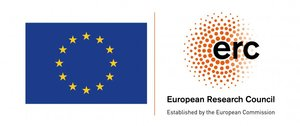
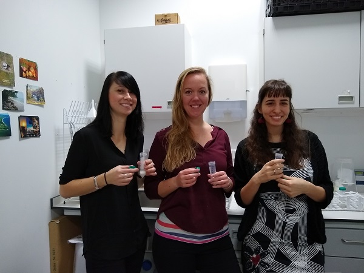
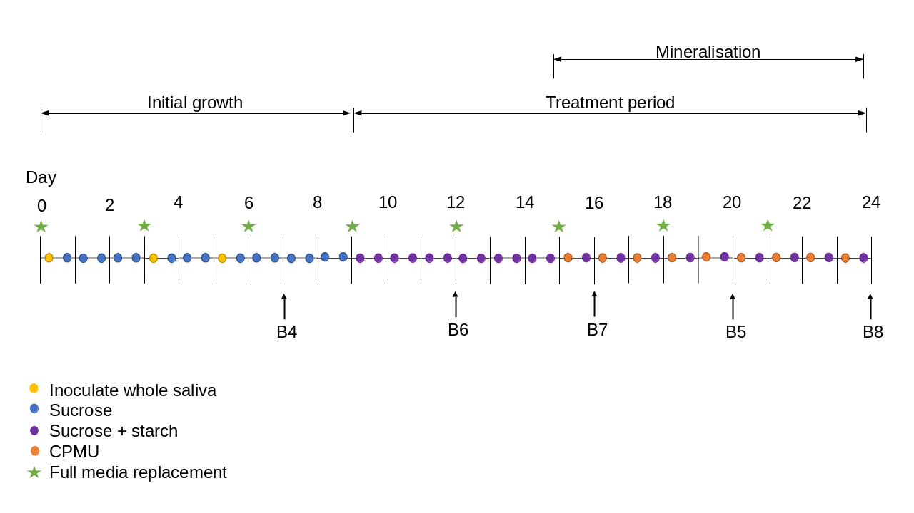
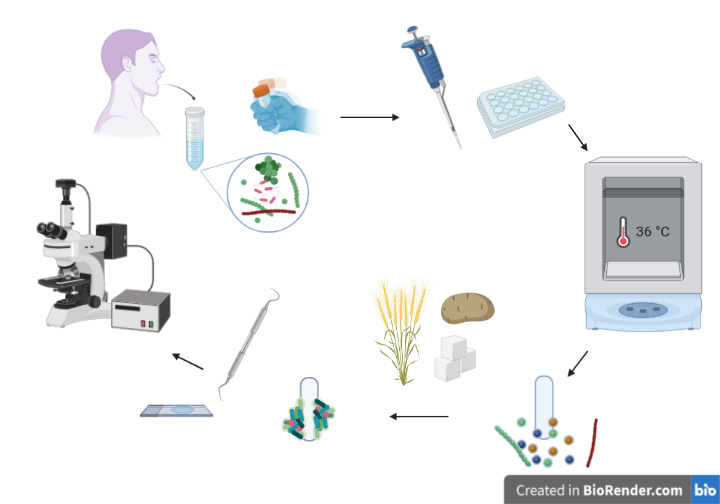
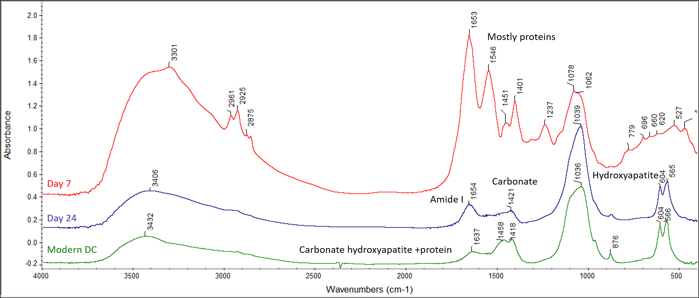

class: inverse, middle, center

```{r include=FALSE}
knitr::opts_chunk$set(echo = F,
                      message = F,
                      warning = F,
                      fig.path = "assets/img/")
library(here)
library(magrittr)
library(dplyr)
source(here("scripts/grind-curve.R"))
xaringanExtra::use_progress_bar(color = "#85b37b", location = "bottom")
ftir_samples <- readr::read_csv(here("assets/data/FTIR_samples.csv"))
```

# `r rmarkdown::metadata$title`

## `r rmarkdown::metadata$subtitle`

### `r rmarkdown::metadata$author`

#### `r params$event` | `r params$date`

[**`r fontawesome::fa("twitter")` OsteoBjorn**](twitter.com/osteobjorn) [**`r fontawesome::fa("github")` bbartholdy**](twitter.com/osteobjorn)  
[**`r fontawesome::fa("link")` harvestproject.eu**](https://www.harvestproject.eu)



---
layout: true
class: middle
<div class="footer"><a href="https://harvestproject.eu"><span>harvestproject.eu</span></a></div>
---

## Open Science Statement

Slides available:
Protocols available: <https://www.protocols.io/workspaces/byoc>
Code available:

---

## About

We have developed an oral biofilm model to grow dental calculus.

The model is intended to explore how dental microremains become
trapped in dental calculus,

and the biases associated with their extraction and interpretation.

???

Whether these biases occur during life, after burial, or during analysis.

---

## Biofilm

Biofilm: Communities of microbial cells within a matrix of extracellular polymers.

---

## Biofilm models

Biofilm model: growing a biofilm in (or moving to) a lab for analysis.

---

.pull-left[
Some are less complex

- agar plate
- multiwell plate
]

--

.pull-right[

than others

- constant depth film fermenter
- modified robbins device
- artificial mouth
]

---
class: inverse

## A recipe for dental calculus `r emo::ji("chef")`

---

## A recipe for dental calculus

Take a 24 deepwell plate with a lid

--

```{r plate-w-lid, out.width=400, fig.align='center', fig.alt="24 deepwell plate with a lid containing 24 pegs."}
knitr::include_graphics("assets/img/plate_lid_on.jpg")
```

--

These are your oral cavity `r emo::ji("tongue")` and "teeth" `r emo::ji("grimace")`

---

## A recipe for dental calculus

Then ask your friends to spit in a tube

--

```{r friends-spit, out.width=400, fig.align='center', fig.alt="volunteers ready to spit into a test tube."}

```

--

(Make sure you're friends with calculus-formers)

--

.small[**Disclaimer**: Not the volunteers from this experiment. Image included for dramatic effect.]

---

## A recipe for dental calculus

Add the donated saliva to the deepwell plate

--

And inoculate the substrata for 4 hours at 36&deg;C



---

## A recipe for dental calculus

Since your friends likely possess a limited quantity of saliva

--

make some artificial saliva for the bacteria to enjoy `r emo::ji("bacteria")`

---
background-image: url(assets/img/artificial-saliva_2.jpg)
background-position: 97% 50%
background-size: 460px

## A recipe for dental calculus

Since your friends likely possess a limited quantity of saliva

make some artificial saliva for the bacteria to enjoy `r emo::ji("bacteria")`

--

Mucin from pig's stomach, `r emo::ji("pig")`

--

some proteins and yeast,

--

some minerals (KCl, NaCl, CaCl2, Na2HPO4),

--

and various other materials for a favourable pH (NaHCO3, haemin, arginine, urea, menadione)

---

## A recipe for dental calculus

After inoculation,

--

transfer the lids to a new plate with artificial saliva,

--

and keep the bacteria happy by feeding them carbohydrates
`r emo::ji("bread")` `r emo::ji("potato")`

--

After a few weeks, the biofilm is fed a mineral cocktail `r emo::ji("cocktail")`
to encourage mineralisation,

containing urea, 
--
 calcium phosphate,
--
 sodium,
--
 fluoride,
--
 chloride,
--
 and a dash of magnesium

---

<!--
It contains 2.5 g/l partially purified mucin from porcine stomach (Type III, Sigma M1778), 
5 g/l trypticase peptone (Roth 2363.1), 10 g/l proteose peptone (Oxoid LP0085),
5 g/l yeast extract (BD 211921), 2.5 g/l KCl, 0.35 g/l NaCl, 1.8 mmol/l CaCl~2~, 
5.2 mmol/l Na~2~HPO~4~ [@sissonsMultistationDentalPlaque1991], 6.4 mmol/l NaHCO~3~ 
[@shellisSyntheticSalivaCultural1978], 2.5 mg/l haemin. This is subsequently 
adjusted to pH 7 with NaOH pellets and stirring, autoclaved (15 min, 120&deg;C, 
1 bar overpressure), and supplemented with 5.8 $\mu$mol/l menadione, 5 mmol/l urea, 
and 1 mmol/l arginine [@sissonsMultistationDentalPlaque1991].
-->

.center[

]

---
class: inverse

## Quality control `r emo::ji("scientist")`

--

In other words,
--
 is it a viable proxy for dental calculus?
 
---

```{r ftir}
summary_tbl <- ftir_samples %>%
  mutate(day = as.factor(day)) %>%
  group_by(day) %>%
  summarise(n = n(),
            weight = mean(weight_mg))
```

.pull-left[
## FTIR analysis

`r dim(ftir_samples)[1]` samples of synthetic dental calculus

sampled on days 7, 12, 16, 20, 24.

Only enough material from `r dim(filter(grind_data, Sample == "Artificial calculus"))[1]` samples for grinding curve.
]
.pull-right[
```{r ftir-table}
col_names <- c("Day", "n", "Weight (mg)")
knitr::kable(summary_tbl, col.names = col_names, caption = "Summary of samples taken for FTIR analysis.")
```
]

---

## Preparing for FTIR

Samples ground together with KBr.

Repeated grinding for different lengths of time.

Analysed with a Thermo Nicolet is5 spectrometer in transmission,

- 4 cm-1 resolution
- average of 32 scans between wavenumbers 4000 and 400 cm-1

---

## FTIR analysis

```{r ftir-spectra, fig.cap="FTIR spectra for artificial calculus from day 7 of biofilm growth (top, red), the final day of growth on day 24 (middle, purple), and a modern dental calculus reference sample (bottom, green)."}

```

---

## FTIR analysis

```{r grind-curve, fig.cap="Grinding curve for artificial calculus samples and reference samples."}
grind_data %>%
  group_by(day, Sample) %>%
  ggplot(aes(x = FWHM, y = IRSF, col = Sample_day, shape = Sample_day)) +
    geom_point(size = 2) +
    geom_smooth(method = "lm", se = F) +
    #theme_minimal() +
    labs(col = "Sample", shape = "Sample") +
    capapres_theme
    #scale_color_viridis_d()
```

---

## FTIR analysis

```{r grind-curve-iso, fig.cap="Grinding curve for artificial calculus samples only."}
grind_data %>%
  filter(Sample == "Artificial calculus") %>%
  #group_by(day, Sample) %>%
  ggplot(aes(x = FWHM, y = IRSF, col = Sample_day, shape = Sample_day)) +
  geom_point(size = 2) +
  geom_smooth(method = "lm", se = F) +
  #theme_minimal() +
  labs(col = "Sample", shape = "Sample") +
  capapres_theme
#scale_color_viridis_d()
```

---

## Discussion

The composition of the model dental calculus is similar to a modern dental calculus sample.

At least in its mineral content, it forms a reasonable proxy for dental calculus.

The method seems suitable to supplement *in vivo* studies
<!-- cite some examples -->

### Further QC

Microbiome characterisation
--
 (in progress)
 
<!-- insert a graph of most abundant species -->

---

## Limitations

The model doesn't account for individual variability of

--

- bacterial composition
- alpha-amylase activity

--

...but these limitations can also be a strength.

--

The bacteria donors are modern humans with a modern microbiome,
so modifications are likely needed to explore palaeodiets

---

## Applications

.pull-left[
Test extraction methods

- HCl
- EDTA

Explore starch incorporation

- effect of amylase
- effect of certain bacteria
]

.pull-right[
Test methodological biases

- DNA
- Proteins
- Microscopy

Calculus methods-training

- Unlimited material available (in theory...)
]
---

## Conclusion

The model dental calculus is similar in composition to modern dental calculus.

There are limitations to an *in vitro* model,

but it can supplement *in vivo* studies by providing a more
controlled setting to explore diet and dental calculus.

---
class: inverse

## Acknowledgements

Prof. Ruth Shahack-Gross, Haifa University

Dr. Susan Mentzer, University of Tubingen
<!-- for use of spectrometers -->

Research funded by the European Research Council under the European Union’s Horizon 2020 research and innovation program, grant agreement number STG–677576 (“HARVEST”)


