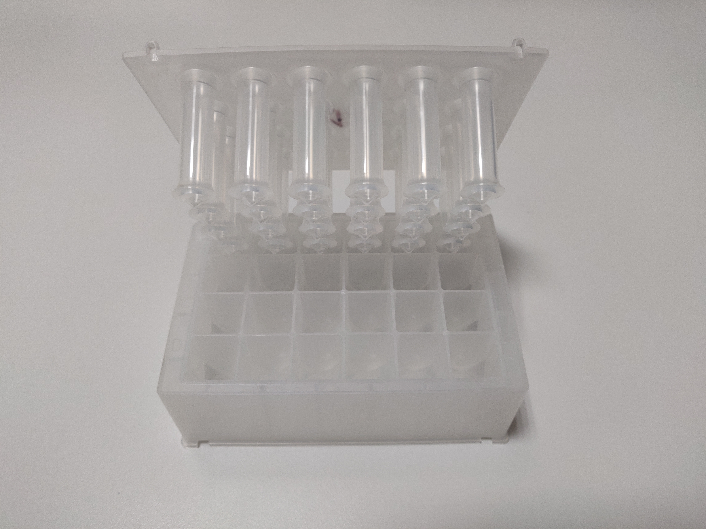

class: inverse, middle, center
background-image: url(assets/img/eu_erc.jpg)
background-position: 97% 97%
background-size: 150px

```{r include=FALSE}
knitr::opts_chunk$set(echo = F,
                      message = F,
                      warning = F,
                      fig.path = "assets/img/")
library(here)
library(magrittr)
library(dplyr)
source(here("scripts/grind-curve.R"))
xaringanExtra::use_progress_bar(color = "#85b37b", location = "bottom")
ftir_samples <- readr::read_csv(here("data", "FTIR_samples.csv"))
```

# `r rmarkdown::metadata$title`

## `r rmarkdown::metadata$subtitle`

### `r rmarkdown::metadata$author`

#### `r params$event` | `r params$date`

[**`r fontawesome::fa("twitter")` OsteoBjorn**](twitter.com/osteobjorn) [**`r fontawesome::fa("github")` bbartholdy**](twitter.com/osteobjorn)  
[**`r fontawesome::fa("link")` harvestproject.eu**](https://www.harvestproject.eu)

---
layout: true
class: middle
<div class="footer"><a href="https://harvestproject.eu"><span>harvestproject.eu</span></a></div>
---

## Open Science Statement

Slides available:  
Protocols available: <https://www.protocols.io/workspaces/byoc>  
Code available: <https://github.com/bbartholdy/2022_AABA-pres>

---

## About

We have developed an oral biofilm model to grow dental calculus.

--

The model is used to explore how dietary microremains/molecules become
trapped in dental calculus,

--

and the biases associated with their extraction and interpretation.

???

Whether these biases occur during life, after burial, or during analysis.

---

## Biofilm

Biofilm: Communities of microbial cells within a matrix of extracellular polymers.

Dental plaque is an example of an oral biofilm.

---
background-image: url(assets/img/biofilm_formation.png)
background-size: 80%
---
.left[
## Biofilm models

Biofilm model: growing a biofilm in (or moving to) a lab for analysis.
]

--

.pull-left[
Some are less complex

- agar plate
- multiwell plate
]

--

.pull-right[

than others

- constant depth film fermenter
- modified robbins device
- multiple artificial mouth
]

---
class: inverse

## A recipe for dental calculus `r emo::ji("chef")`

---

## A recipe for dental calculus

Take a 24 deepwell plate with a lid

--

```{r plate-w-lid, out.width=400, fig.align='center', fig.alt="24 deepwell plate with a lid containing 24 pegs."}

```

--

These are your oral cavity `r emo::ji("tongue")` and "teeth" `r emo::ji("grimace")`

---
background-image: url(assets/img/inoculation.png)
background-position: 90% 50%

## A recipe for dental calculus

Then ask your friends to spit in a tube

--

(Make sure you're friends with calculus-formers)

--

Add the donated saliva to the deepwell plate

--

And inoculate the substrata for 4 hours at 36&deg;C

---

## A recipe for dental calculus

Since your friends likely possess a limited quantity of saliva

--

make some artificial saliva for the bacteria to enjoy `r emo::ji("bacteria")`

---
background-image: url(assets/img/artificial-saliva_2.jpg)
background-position: 97% 50%
background-size: 460px

## A recipe for dental calculus

Since your friends likely possess a limited quantity of saliva

make some artificial saliva for the bacteria to enjoy `r emo::ji("bacteria")`

--

- Mucin from pig's stomach, `r emo::ji("pig")`

--

- some proteins and yeast,

--

- some minerals (KCl, NaCl, CaCl2, Na2HPO4),

--

- and various other materials for a favourable pH  
(NaHCO3, haemin, arginine, urea, menadione)

---
background-image: url(assets/img/inoculation.png)
background-position: 90% 50%

## A recipe for dental calculus

After inoculation,

--

transfer the lids to a new plate with artificial saliva,

---
background-image: url(assets/img/feeding.png)
background-position: 90% 50%

## A recipe for dental calculus

After inoculation,

transfer the lids to a new plate with artificial saliva,

and keep the bacteria happy by feeding them  
carbohydrates

---
background-image: url(assets/img/feeding.png)
background-position: 90% 50%

## A recipe for dental calculus

After a two weeks, the biofilm is fed a mineral cocktail `r emo::ji("cocktail")`  
to promote mineralisation, containing 

---
background-image: url(assets/img/mineralisation.png)
background-position: 90% 50%

## A recipe for dental calculus

After a two weeks, the biofilm is fed a mineral cocktail `r emo::ji("cocktail")`  
to promote mineralisation, containing 

- urea, 
--

- calcium phosphate,  

--

- sodium,

--

- fluoride,

--

- chloride,

--

- and a dash of magnesium

---
background-image: url(assets/img/mineralisation.png)
background-position: 90% 50%

## et violà!

```{r calculus, fig.align='center', out.width=600}

```

---
class: inverse

## Quality control `r emo::ji("scientist")`

--

In other words,
--
 is it a viable proxy for dental calculus?
 
---

```{r ftir}
summary_tbl <- ftir_samples %>%
  mutate(day = as.factor(day)) %>%
  group_by(day) %>%
  summarise(n = n(),
            weight = signif(mean(weight_mg), 3),
            sd = signif(sd(weight_mg), 3))
summary_tbl_out <- summary_tbl %>%
  mutate(day = paste(day, "  (n = ", n, ")"),
         weight = signif(weight, 3)) %>%
  select(!n)
```

.pull-left[
## FTIR analysis

`r dim(ftir_samples)[1]` samples of synthetic dental calculus

sampled on days 7, 12, 16, 20, 24

`r dim(filter(grind_data, Sample == "Artificial calculus", grind == "a"))[1]` samples used for grinding curve  
following *Asscher et al. 2011*.

]
.pull-right[
```{r ftir-table}
col_names <- c("Day", "n", "Mean weight (mg)", "SD")
knitr::kable(summary_tbl, col.names = col_names, caption = "Summary of samples taken for FTIR analysis.", align = "c")
#col_names <- c("Day", "Mean weight (mg)")
#knitr::kable(summary_tbl_out, col.names = col_names, caption = "Summary of samples taken for FTIR analysis.", align = "c")
```
]

---

## Preparing for FTIR

Samples ground together with KBr.

Repeated grinding for different lengths of time.

Analysed with a Thermo Nicolet is5 spectrometer in transmission,

- 4 cm-1 resolution
- average of 32 scans between wavenumbers 4000 and 400 cm-1

---

```{r ftir-spectra, fig.align='center', fig.width=10, fig.cap="FTIR spectra for artificial calculus from day 7 of biofilm growth (top, red), the final day of growth on day 24 (middle, purple), and a modern dental calculus reference sample (bottom, green)."}

```

---

```{r grind-curve, fig.retina=2, fig.align='center', fig.width=10, fig.cap="Grinding curve for artificial calculus samples and reference samples."}
grind_data %>%
  group_by(day, Sample) %>%
  ggplot(aes(x = FWHM, y = IRSF, col = Sample_day, shape = Sample_day)) +
    geom_point(size = 2) +
    geom_smooth(method = "lm", se = F) +
    #theme_minimal() +
    labs(col = "Sample", shape = "Sample",
         x = "FWHM of the 1035 peak",
         y = "Splitting factor (IRSF)") +
    harvest_theme
    #scale_color_viridis_d()
```

---

```{r grind-curve-iso, fig.retina=2, fig.align='center', fig.width=10, fig.cap="Grinding curve for artificial calculus samples only."}
grind_data %>%
  filter(Sample == "Artificial calculus") %>%
  #group_by(day, Sample) %>%
  ggplot(aes(x = FWHM, y = IRSF, col = Sample_day, shape = Sample_day)) +
  geom_point(size = 2) +
  geom_smooth(method = "lm", se = F) +
  #theme_minimal() +
  labs(col = "Sample", shape = "Sample",
       x = "FWHM of the 1035 peak",
       y = "Splitting factor (IRSF)") +
  harvest_theme
#scale_color_viridis_d()
```

---

## Discussion

Seemingly no differences in crystallinity (IRSF) between day 16 and 24

- The 'mineralisation' solution doesn't seem to have much effect

--

The composition of the model dental calculus is similar to a modern dental calculus sample.

--

At least in its mineral content, it forms a reasonable proxy for dental calculus.

--

The method seems suitable to complement *in vivo* studies

--

Our goal is NOT to replace *in vivo* studies.
--
 There are very different questions that can be addressed
 
---

## Limitations

The model doesn't account for individual variability of

--

- bacterial composition
- alpha-amylase activity

--

...but these limitations can also be a strength.

--

Calculus deposits are thin and likely don't contain many layers (short maturation period)

--

The bacteria donors are modern humans with a modern microbiome,
so modifications are likely needed to explore palaeodiets

--

Microbiome characterisation
--
 (in progress)
 
<!-- insert a graph of most abundant species -->

---

.left[
## Applications
]
.pull-left[
Test extraction methods

- HCl
- EDTA

Explore starch incorporation

- effect of amylase
- effect of certain bacteria
]

--

.pull-right[

Test methodological biases

- DNA
- Proteins
- Microscopy

Calculus methods-training

- Unlimited material available (in theory...)
]
---

## Conclusion

The model dental calculus is similar in composition to modern dental calculus.

--

There are limitations to an *in vitro* model,

--

but it can complement *in vivo* studies by providing a more
controlled setting to explore diet and dental calculus.

---
background-image: url(assets/img/preprint.png)
background-position: 92% 50%
background-size: 45%

## See also

Application of the model:  
<https://doi.org/10.1101/2021.10.27.466104>

---
class: inverse

## Acknowledgements

**Prof. Ruth Shahack-Gross**, Haifa University

**Dr. Susan Mentzer**, University of Tubingen
<!-- for use of spectrometers -->

Research funded by the European Research Council under the European Union’s Horizon 2020 research and innovation program, grant agreement number STG–677576 (“HARVEST”)


---

.left[
## References
]
.small[
Asscher, Y., Regev, L., Weiner, S., & Boaretto, E. (2011). Atomic Disorder in Fossil Tooth and Bone Mineral: An FTIR Study Using the Grinding Curve Method. ArcheoSciences. Revue d’archéométrie, 35, 135–141. https://doi.org/10.4000/archeosciences.3062

Sissons, C. H., Cutress, T. W., Hoffman, M. P., & Wakefield, J. S. J. (1991). A Multi-station Dental Plaque Microcosm (Artificial Mouth) for the Study of Plaque Growth, Metabolism, pH, and Mineralization: Journal of Dental Research. https://doi.org/10.1177/00220345910700110301


]